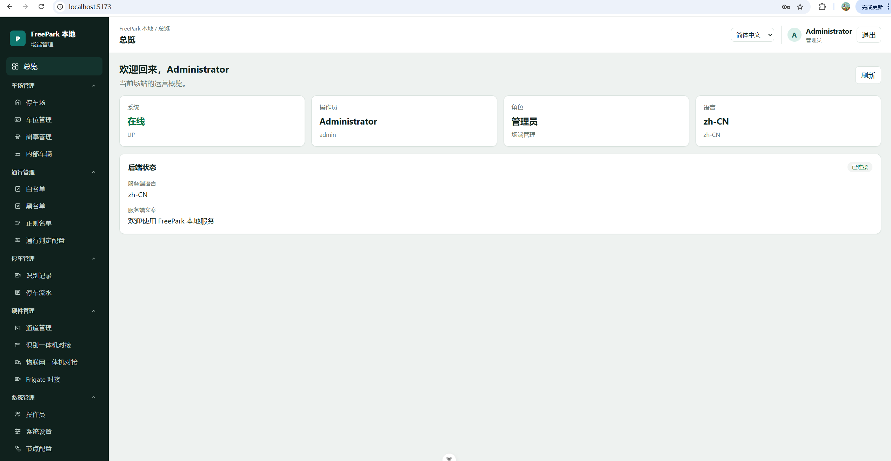
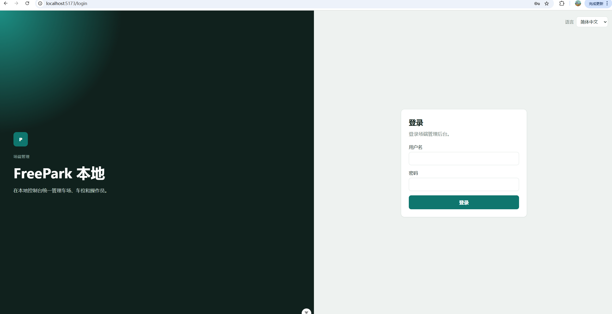

# FreePark

Use AI and related open-source tools to build an I18N (internationalized) parking system. This system is intended to help people around the world solve parking problems.

用 AI 与开源工具构建一套国际化（I18N）停车系统，帮助全球用户更高效地解决停车问题。

## Product Preview / 界面预览





## What is it / 项目定位

FreePark is an on-premise **edge computing** parking system: `local_server` + `local_frontend` run entirely at the site. Vehicle recognition, lane / booth control, whitelist / blacklist, access judgment, and parking flow all close the loop locally without depending on a cloud service.

FreePark 是一套部署在车场本地的**停车场边缘计算**系统：`local_server` 与 `local_frontend` 完全运行在车场端，车牌识别、通道 / 岗亭控制、白名单 / 黑名单、通行判定与停车流水等均在场端本地闭环处理，不依赖云端。

**If you do not need charging / billing, you can use this project directly**: access control (whitelist / blacklist / pattern allowlist), manual recognition supplement, barrier and booth gate open / close, parking flow, and more are available out of the box — no billing module is required.

**如果没有收费需求，本仓库可直接投入使用**：白名单 / 黑名单 / 正则名单通行控制、人工识别补录、道闸与岗亭开闸 / 关闸、停车流水等能力开箱即用，无需额外接入收费模块。

## Built with AI / 由 AI 驱动构建

This project is an **attempt to be built by AI**: we strive to let AI write the code while humans focus on requirements, design decisions, and review — minimizing hand-written code as much as possible.

本项目**尝试完全由 AI 来构建**：尽力让 AI 完成代码编写，人类只负责提出需求、做设计决策并进行审查，努力做到人工不直接编写代码。

## Vision / 愿景

- Make it easier to find, share, and manage parking spaces across countries and cities.

- 降低找车位、共享车位、管理停车资源的成本，覆盖多国家、多城市场景。

## Goals / 目标

- **I18N first**: language, locale, currency, time zone, and map data should work worldwide.

- **AI-assisted**: use AI to improve search, matching, occupancy prediction, and operations.

- **Open source**: prefer existing open-source components over reinventing the stack.

- **国际化优先**：语言、地区、货币、时区、地图数据面向全球可用。

- **AI 辅助**：用 AI 提升搜索、匹配、占用预测与运营效率。

- **开源优先**：尽量复用成熟开源组件，而不是从零造轮子。

## Backend / 后端

The backend uses Java 21, Spring Data JPA, MySQL, and HTTP I18N (`Accept-Language` or `?lang=`).

后端使用 Java 21、Spring Data JPA、MySQL，并支持接口国际化。

- [`local_server`](local_server/README.md): on-premise / edge service, default port `8081`

- [`local_frontend`](local_frontend/README.md): Vue 3 + vue-i18n console for `local_server`, default port `5173`

- [`docker/frigate`](docker/frigate/README.md): Frigate **0.17.2** NVR / LPR + go2rtc (Docker)

- [`docker/hyperlpr3`](docker/hyperlpr3/README.md): HyperLPR3 **0.1.3** REST (port `8715`)

## AI deploy / AI 部署

[`ai-build`](ai-build/README.md) is a **reference** for deploying this project (including handing the job to another AI). It is not the only valid way: adapt Docker, ports, and process layout to your own environment.

[`ai-build`](ai-build/README.md) 是一份**参考**部署说明（也可交给其它 AI 执行），不是唯一做法。可按自己的环境调整 Docker、端口与进程安排。

**Beginners:** this stack needs Docker, JDK, Node.js and some command-line work. If you are not comfortable with that, ask someone with computer / ops experience to deploy it for you.

**小白建议：** 本项目需要 Docker、JDK、Node.js 和基本命令行操作。若不熟悉这些，请找有一定电脑基础（或运维经验）的人员来部署。

To have another AI follow the sample path, paste [`ai-build/PROMPT.md`](ai-build/PROMPT.md), or tell it to follow [`ai-build/AGENTS.md`](ai-build/AGENTS.md). Pick **one** OS tree and do not mix them.

若按参考流程交给其它 AI：把 [`ai-build/PROMPT.md`](ai-build/PROMPT.md) 贴给它，或让它执行 `ai-build/AGENTS.md`。只选一套系统目录，不要混用。

| Host OS | Scripts |
| --- | --- |
| Windows | [`ai-build/windows`](ai-build/windows/README.md) |
| Linux / macOS | [`ai-build/linux`](ai-build/linux/README.md) |

Need Docker, JDK 21, and Node.js 22+ on the machine. Local stack is **five services**: MySQL `8.4.11`, Frigate `0.17.2`, HyperLPR3 `0.1.3`, then `local_server` `:8081` and `local_frontend` `:5173`. MQTT is **not** deployed on site. Pins: [`ai-build/VERSIONS.md`](ai-build/VERSIONS.md).

本机需要 Docker、JDK 21、Node.js 22+。本地只部署 **五个服务**：MySQL `8.4.11`、Frigate `0.17.2`、HyperLPR3 `0.1.3`，以及后端 `:8081` 与前端 `:5173`。**场端不部署 MQTT。** 版本钉死见 [`ai-build/VERSIONS.md`](ai-build/VERSIONS.md)。

Windows:

```powershell
powershell -File ai-build/windows/up.ps1
powershell -File ai-build/windows/install.ps1
```

Linux / macOS:

```sh
sh ai-build/linux/up.sh
sh ai-build/linux/install.sh
```

Then start `local_server` and `local_frontend`, and run `verify` in the same OS folder. Full order: [`ai-build/AGENTS.md`](ai-build/AGENTS.md).

随后在同一系统目录下启动后端、前端并执行 `verify`。完整顺序见 [`ai-build/AGENTS.md`](ai-build/AGENTS.md)。

Console / 控制台： [http://localhost:5173](http://localhost:5173) — `admin` / `admin123`.

## Default account / 默认账号

On first startup, sign in with the default account:

首次启动后，使用以下默认账号登录：

- username / 用户名：`admin`

- password / 密码：`admin123`

Override via environment variables `FREEPARK_ADMIN_USERNAME` and `FREEPARK_ADMIN_PASSWORD`. **Change this password in production.**

可通过环境变量 `FREEPARK_ADMIN_USERNAME` / `FREEPARK_ADMIN_PASSWORD` 覆盖。**生产环境请务必修改默认密码。**

## Status / 当前状态

FreePark is **still under active development**. A runnable on-premise prototype is already in place, covering: plate recognition (Frigate + HyperLPR3), whitelist / blacklist / pattern allowlist access control, lane and booth control, barrier open / close, parking flow and recognition records, a multi-floor parking map editor (lanes, spaces, entrances / exits), and a 10-language I18N web console. Features and fixes are landing continuously; no stable release yet.

FreePark **仍在积极开发中**。目前已具备可运行的本地部署雏形，涵盖：车牌识别（Frigate + HyperLPR3）、白名单 / 黑名单 / 正则名单通行控制、通道 / 岗亭控制与道闸开关、停车流水与识别记录、多楼层停车场地图编辑器（通道、车位、出入口），以及 10 种语言的国际化 Web 控制台。功能与修复持续更新中，尚未发布稳定版本。

## Support / 支持

If you find this project helpful, please give me a **star**. Your support is my greatest motivation to keep building.

如果觉得本项目对您有帮助，请给我一个 **star**，您的支持是我持续开发的动力。

## Contributing / 参与

Issues and pull requests are welcome.

欢迎提交 Issue 和 Pull Request。

## Ethical use / 伦理使用

FreePark is for people and organizations that **respect workers' rights**. We oppose exploitative labor practices.

FreePark 面向**尊重劳动者权益**的个人与组织。我们反对下列剥削性做法。

**Organizations that practice any of the following may not use this software** (including deployment, operations, or offering it as a service):

**实施以下任一做法的组织不得使用本软件**（含部署、运营或对外提供服务）：

- **“996”** and systemic exploitative overtime / **996** 与系统性剥削性加班

- **Unequal pay for equal work** / **同工不同酬**

- **Labor outsourcing** used to evade employer duties and worker protections / 以规避用工责任、损害劳动者保障的**人力外包**

Full policy: [ETHICAL\_USE.md](ETHICAL_USE.md)

完整声明见 [ETHICAL\_USE.md](ETHICAL_USE.md)。

## License / 许可证

Copyright (C) 2026 顾文斌

This project is licensed under the **Apache License 2.0**.

- Full license text: [LICENSE](LICENSE)

- Summary: you may use, modify, and distribute this software, including for commercial purposes; you must retain copyright notices, include the license text, and mark significant changes. See the license for full terms.

- Ethical expectations: [ETHICAL\_USE.md](ETHICAL_USE.md) (read together with the license).

本项目采用 **Apache License 2.0** 授权。

- 完整协议文本见 [LICENSE](LICENSE)

- 简要说明：可自由使用、修改和分发，包括商业用途；须保留版权声明、附上许可证文本，并注明重大修改。具体权利与义务以协议全文为准。

- 伦理使用期望见 [ETHICAL\_USE.md](ETHICAL_USE.md)（与许可证一并阅读）。

