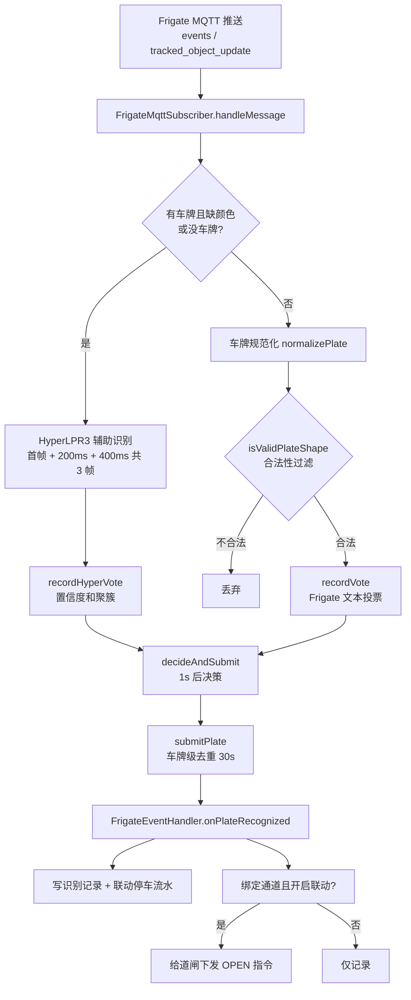

# Frigate 车牌识别业务逻辑

> 对应实现：[FrigateMqttSubscriber.java](../src/main/java/com/freepark/local/frigate/service/FrigateMqttSubscriber.java)
> 与 [FrigateEventHandler.java](../src/main/java/com/freepark/local/frigate/service/FrigateEventHandler.java)
> 模块：`local_server` 后端服务，Frigate 0.17.2（Dedicated LPR）直连模式。

## 1. 架构总览

本系统不使用 Frigate 自带的「识别后主动推送到后端」完成全部工作，而是由后端自己订阅 MQTT 消息，并对 Frigate 的识别结果做**二次校验与补全**：

- **Frigate 原生 LPR**：识别速度快，但**不出车牌颜色**，且动态车辆场景下偶尔输出丢省份汉字的变体（如 `B2V9L7` 而非 `浙B2V9L7`）。
- **HyperLPR3（本地服务，端口 8715）**：能出车牌（含省份汉字）、车牌颜色（`plate_type`）与置信度，作为辅助识别引擎。
- 二者结合：**HyperLPR3 优先、Frigate 辅助**，最终决策出「最可信的车牌 + 颜色」，再入库并联动开闸。



## 2. MQTT 订阅与消息来源

`FrigateMqttSubscriber` 通过 Paho MQTT 客户端连接 Frigate 的 MQTT broker（`tcp://{mqttHost}:{mqttPort}`），订阅三个主题（`topicPrefix` 默认 `frigate`）：

| 主题 | 说明 |
| --- | --- |
| `{prefix}/events` | 全局事件流（new/update/end） |
| `{prefix}/+/events` | 每相机事件流 |
| `{prefix}/+` | 每相机状态/识别结果，**Dedicated LPR 的 `tracked_object_update` 走这里** |

连接特性：`AutomaticReconnect` 自动重连、`CleanSession`、8s 连接超时、30s keepalive；连接状态（`CONNECTED`/`FAILED`）回写 `FrigateLinkStatus`，页面「系统设置 → Frigate」可见。

> 注意：`{prefix}/+` 主题里的 topic 段**不是相机名**，相机名取自 `payload.camera` 字段。

## 3. 消息解析（handleMessage）

按主题分流：

- **`/events` 主题**：取 `payload.after` 节点（缺失时回退到根节点），读取 `camera`、`id`（作为 trackId）、`plate`、`plateColor`。
- **`{prefix}/+` 主题**：直接以整包为节点，`camera = payload.camera ?? topic 段`，`id` 为 trackId。

### 3.1 车牌提取（extractPlate）

按顺序取第一个非空值：`plate` → `plateNumber` → `plate_number` → `license_plate` → `recognized_license_plate` → `sub_label`（字符串或数组首元素）→ `current_attributes.license_plate / recognized_license_plate / plate`。

### 3.2 颜色提取（extractColor）

优先级：顶层 `plateColor / plate_color / colorName / color / plate_color_name / license_plate_color` → `current_attributes.*` → **数字索引** `colorIndex`（LPR 设备常见透传，如 0=蓝、1=黄、2=白、3=黑、4/5=绿、6=黄绿）。

颜色字符串支持 `PlateColor` 枚举名及中文别名（蓝/黄/白/黑/绿/黄绿/渐变绿…）。

## 4. HyperLPR3 辅助识别（多帧采样）

触发条件：`cameraName 非空` 且（`plate` 为空 **或** 缺颜色）。即「Frigate 没识别出牌」或「识别出牌但没颜色」时才启动辅助。

1. **去重**：`tryReserveLprAttempt(trackId)`，同一 track/event 在 120 秒内只辅助识别一次（LPR_DEDUP_WINDOW_MS），防止 `new/update/end` 高频推送反复触发。
2. **首帧**：`lprCompleteFromEvent` 优先取事件 `snapshot` 路径，否则 `/api/events/{id}/snapshot.jpg`，否则回退相机最新帧 `/api/{camera}/latest.jpg`，下载后交 HyperLPR3 识别，得到 `LprResult(plate, plateColor, confidence)`。
3. **补抽 2 帧**：`scheduleHyperLprFrames` 在 +200ms、+400ms 各再抓一次 `latest.jpg` 识别（`frame2`/`frame3`），3 次抽帧在 **500ms 内**完成，避免只依赖一张快照的噪声/时机差。
4. 每帧合法结果通过 `recordHyperVote` 计入 track 的 HyperLPR3 聚簇（**不刷新** track 的活跃时间，避免拖慢 1s 出结果）。
5. **立即排程投票**：`setHyperLpr` 后马上 `scheduleVote(trackId)`——即使 Frigate 后续文本全被过滤，HyperLPR3 聚簇结果也能兜底提交，防止 pending 悬空。

### 4.1 首帧对当前消息文本的处理

- Frigate 无车牌 → 用 HyperLPR3 车牌。
- 两者一致 → 日志 `verified`。
- Frigate 车牌非法（如丢省份汉字）、HyperLPR3 合法 → 采用 HyperLPR3。
- 两者都合法但不一致 → 保留 Frigate 车牌（warn 日志）。
- 缺颜色 → 用 HyperLPR3 颜色。

## 5. 车牌规范化与合法性过滤

- `normalizePlate`：去除中点分隔符（`浙B·2V9L7` → `浙B2V9L7`）、横线、空格、统一大写。
- `PlateShape.isValid`：校验国内车牌结构（省份汉字开头 + 第二位字母 + 5~6 位），**不合法直接丢弃**，从源头拦掉杂物误识别（如 `08/30/2026`、`0980`、`4D98L`）。

## 6. Track 多帧投票与决策

同一 Frigate track（`trackId`）会持续推送多帧识别文本，单帧可能漂移（如 `浙BR7978 → BR7978 → R7976`）。因此：

1. **Frigate 文本投票**：`recordVote(normalized, color)` 对每个合法候选 +1，并刷新 `lastUpdateAt`。
2. **投票排程**：`scheduleVote` 同一 track 只保留一个待执行任务（`future != null` 直接跳过）；容量保护 `PENDING_MAX_SIZE=500`，超限时回收超过 `TRACK_MAX_AGE_MS`（12s）的过期 track。
3. **决策**（`decideAndSubmit`，投票延迟 `TRACK_VOTE_DELAY_MS=1s`）：
   - track 仍活跃（1s 内有更新）且未超龄（<12s）→ 顺延再等 1s。
   - **HyperLPR3 优先**：`hyperVotes` 中**置信度和最高**且合法的车牌采用（`source=HyperLPR3`），颜色取聚簇颜色。
   - 否则 **Frigate 票数最高**者（`source=Frigate`）。
   - 两者都无 → `drop`，清理 pending。
   - 颜色取 `HyperVote.color()`（聚簇颜色），缺省用 `lastEventColor`。
4. 提交后移除 pending。

## 7. 车牌级去重（可配置）

`shouldSubmitPlate`：key = `camera|plate`，同一相机识别出同一合法车牌，在 `plateDedupWindowMs`（默认 **30000ms**，可配置）内只入一次库：

- 窗口内重复 → 丢弃（`duplicate within ...` 日志）。
- **窗口过期 → 允许同一车牌再次识别并刷新时间**（修复「同车牌隔很久第二次识别不出来」的问题）。
- 防内存增长：超 `PLATE_DEDUP_MAX_SIZE`（2000）或每 64 次写入，清理过期条目。

配置项（application.yml）：

```yaml
freepark:
  frigate:
    # 同一相机识别出同一合法车牌后的入库去重窗口（毫秒）
    plate-dedup-window-ms: ${FRIGATE_PLATE_DEDUP_WINDOW_MS:30000}
```

## 8. 提交 → 入库与开闸联动

`submitPlate` → `FrigateEventHandler.onPlateRecognized(camera, plate, color)`：

1. 相机未知或禁用 → 忽略。
2. 更新相机状态（`lastPlate`、`lastPlateColor`、`lastEventAt`、`CONNECTED`）。
3. **无条件写一条识别记录**（关联 Frigate 相机、方向 IN/OUT、时间），并联动停车流水（入场/出场）。
4. 仅当**绑定通道 + 开启联动**时：查询通道下启用的道闸，逐个通过 `DeviceCommandService.enqueueSystemDetached`（独立事务 `REQUIRES_NEW`）下发 `OPEN` 指令，来源 `frigate:{camera}`。开闸入队失败仅告警，**不影响已写入的识别记录**。

## 9. 关键参数表

| 参数 | 常量/配置 | 默认 | 含义 |
| --- | --- | --- | --- |
| LPR_DEDUP_WINDOW_MS | 常量 | 120_000 | HyperLPR3 辅助去重窗口（同一 track 只辅助一次） |
| TRACK_VOTE_DELAY_MS | 常量 | 1_000 | 投票延迟 / 出结果时间（track 停止更新后提交） |
| TRACK_MAX_AGE_MS | 常量 | 12_000 | track 最长等待（超限强制提交） |
| PENDING_MAX_SIZE | 常量 | 500 | 待投票 track 上限（超限回收） |
| plateDedupWindowMs | `freepark.frigate.plate-dedup-window-ms` | 30_000 | 车牌级入库去重窗口 |
| PLATE_DEDUP_MAX_SIZE | 常量 | 2000 | 车牌去重 map 上限 |
| HyperLPR3 快照间隔 | 常量 | 200ms / 400ms | 第 2/3 帧采样时间 |

## 10. 日志关键字速查

| 日志 | 含义 |
| --- | --- |
| `Frigate LPR completed ... plate=... conf=...` | HyperLPR3 首帧识别结果 |
| `Frigate LPR frame camera=... frame2/3 ...` | 补抽帧识别结果 |
| `Frigate plate {} invalid, use HyperLPR3 {}` | Frigate 非法文本被 HyperLPR3 替换 |
| `Frigate LPR submit track=... source=HyperLPR3/Frigate hyper=... votes=...` | 投票决策结果及票数分布 |
| `Frigate LPR drop ... no confident plate` | 无可信结果丢弃 |
| `Frigate LPR drop ... duplicate within ...ms` | 车牌去重窗口内重复 |
| `Frigate MQTT event camera=... plate=... color=...` | 提交入库 |
| `recognition record saved id=...` | 识别记录已写入数据库 |

## 11. 边界情况与设计权衡

- **出结果速度**：投票延迟固定 1s，track 活跃时最多延长到 12s 强制提交；抽样帧不刷新 track 活跃时间，保证「短时间出结果」。
- **跨 track 防重**：去重键是 `camera|plate`（非 trackId），即使 track 断开重建也不会同一辆车反复入库。
- **同车牌再次识别**：去重窗口过期即放行，配合自动重连，间隔很久的二次过闸可正常识别。
- **异常兜底**：MQTT 断开自动重连；快照下载失败/识别失败均只记日志不抛出；单个事件异常不会影响后续消息。
